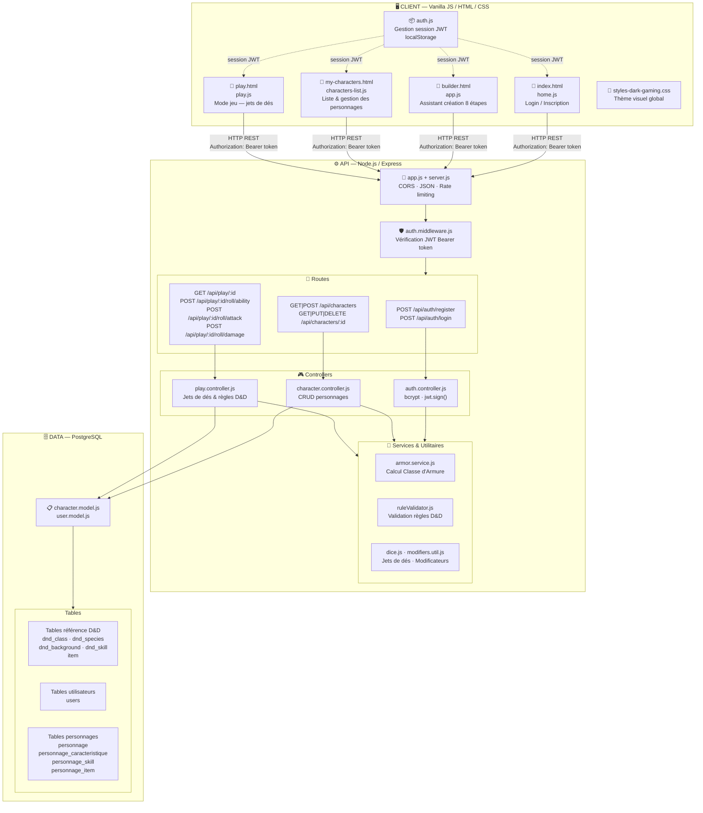
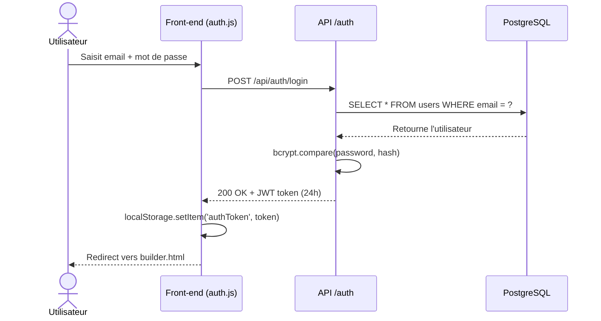
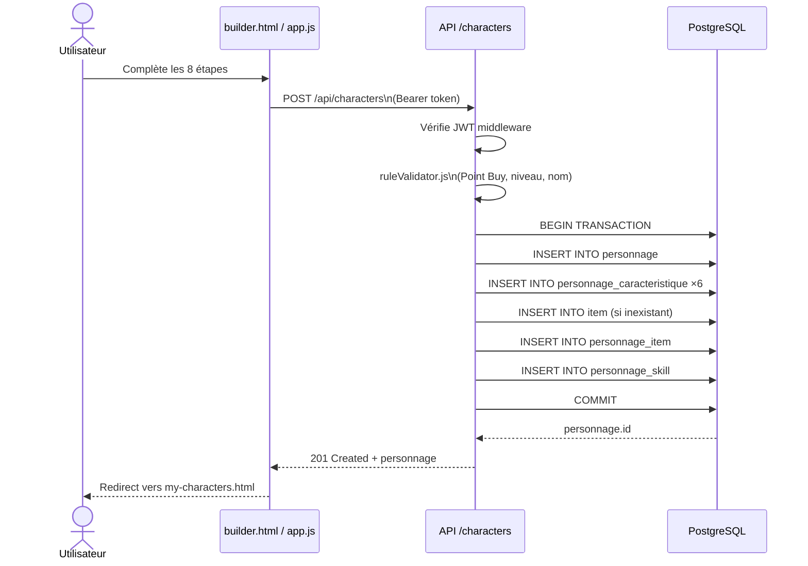
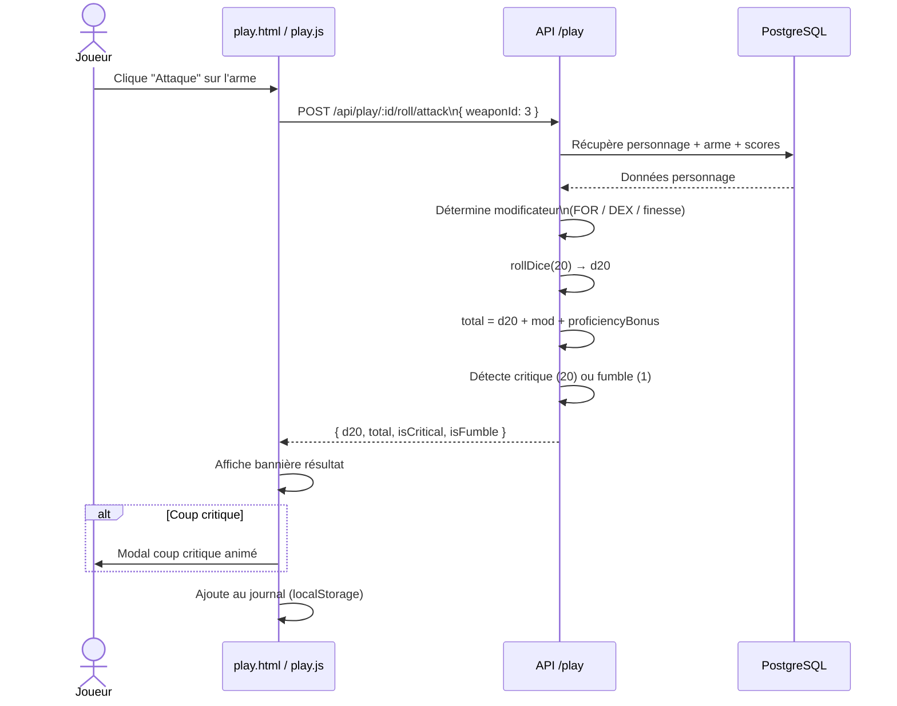
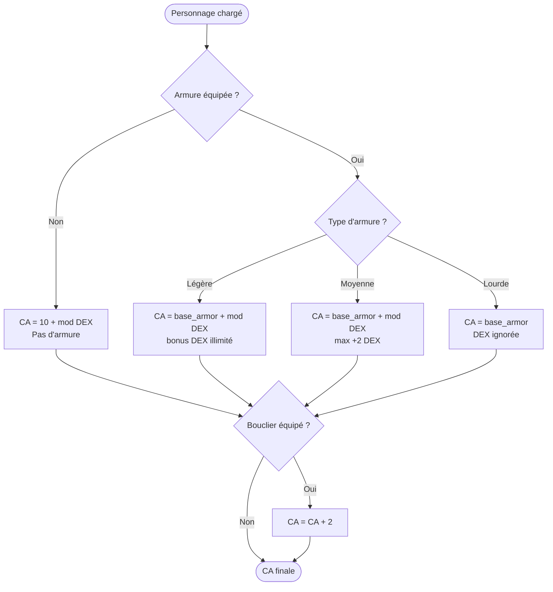

# 🏗️ Architecture de l'Application — D&D 5e Character Builder

> Node.js · Express · PostgreSQL · Vanilla JS

---

## Vue d'ensemble

---

## Flux d'authentification

---

## Flux de création de personnage

---

## Flux d'un jet d'attaque (Mode Jeu)

---

## Calcul de la Classe d'Armure

---

## Stack technique

| Couche | Technologies |
|--------|-------------|
| **Front-end** | HTML5, CSS3 (variables CSS), Vanilla JavaScript ES6+ |
| **Back-end** | Node.js, Express.js, JWT (jsonwebtoken), bcrypt, express-rate-limit |
| **Base de données** | PostgreSQL 14+, node-postgres (pg), JSONB |
| **Sécurité** | Bcrypt (10 rounds), JWT 24h, Rate limiting, Requêtes paramétrées |
| **Logs** | Winston |
| **Tests** | Postman (tests manuels API), Chrome DevTools |