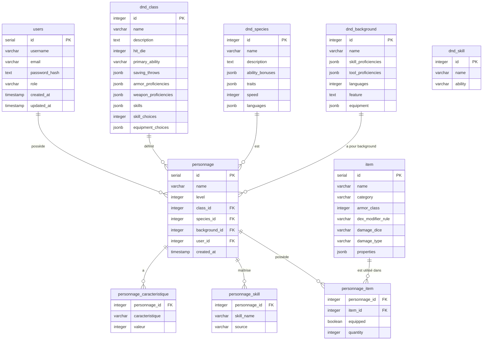

# 🗄️ Schéma de Base de Données — D&D 5e Character Builder

> PostgreSQL · 13 tables · Diagramme entité-relation



---

## 📌 Notes sur le schéma

### Clés primaires composites
Les tables de liaison utilisent des clés primaires composites :
- `personnage_caracteristique` : `(personnage_id, caracteristique)`
- `personnage_skill` : `(personnage_id, skill_name)`
- `personnage_item` : `(personnage_id, item_id)`

### Colonnes JSONB
Le type `JSONB` de PostgreSQL est utilisé pour stocker des structures flexibles propres à D&D 5e :

| Table | Colonne | Contenu |
|-------|---------|---------|
| `dnd_species` | `ability_bonuses` | `{"str": 1, "con": 2}` |
| `dnd_species` | `traits` | `["Darkvision", "Fey Ancestry"]` |
| `dnd_class` | `saving_throws` | `["str", "con"]` |
| `dnd_class` | `skills` | `["Athletics", "Intimidation", ...]` |
| `item` | `properties` | `["versatile", "finesse"]` |

### Contraintes CHECK
- `personnage_caracteristique.caracteristique` : valeur parmi `str, dex, con, int, wis, cha`
- `personnage_caracteristique.valeur` : entre 1 et 30
- `personnage.level` : entre 1 et 20

### Transactions SQL
La création d'un personnage est une **opération atomique** : si une étape échoue (insertion des scores, compétences ou équipement), toute la transaction est annulée (`ROLLBACK`).

```sql
BEGIN;
  INSERT INTO personnage ...
  INSERT INTO personnage_caracteristique ...  (×6)
  INSERT INTO personnage_skill ...            (×N)
  INSERT INTO item ...                        (si inexistant)
  INSERT INTO personnage_item ...             (×N)
COMMIT;
```